# SSAFY 9기 공통프로젝트

# 🦎 파충류치원

## **0️⃣ 프로젝트 개요**

🎈 프로젝트명 : 파충류치원

📌 프로젝트 컨셉 : Web IoT를 활용한 스마트 파충류 케이지

🛠 개발 기간 : 23.07.10 ~ 23.08.18 (6주)

🧑🏻 팀원 : 인정환, 김민태, 김한주, 손세이, 조윤상

💻 사용 기술스택 : SpringBoot, React, AWS + (4. 시스템 아키텍처 참고)

## **1️⃣ 팀원 정보 및 업무 분담 내역**

| 이름            | 역할     | 설명                                                        |
| --------------- | -------- | ------------------------------------------------------------ |
| 인정환 (팀장)   | IoT      | MQTT 프로토콜을 통해 카메라 각도 조절<br /> flask 프레임 워크로 실시간 영상 <br /> QT 프레임 워크와 uart 통신을 활용하여 내장 디스플레이 인터페이스 구현 |
| 김민태 (부팀장) | Backend  | 프로젝트 기획 및 설계<br/>Backend Entity 및 API 구현<br />Figma 제작<br />ERD 설계 |
| 김한주          | Frontend | React와 TypeScript를 활용한 Frontend 구현<br />Zustand를 활용한 상태 관리 구현<br />Figma 제작<br />ERD 설계 |
| 손세이          | IoT      | IoT Kit 관리 / Cage 및 폭포 3D 모델링<br />MQTT 통신 구현 <br />센싱 및 액츄에이터 동작 구현<br />uart 통신을 통한 액츄에이터 제어 구현<br />Jira 관리<br />UCC 제작 |
| 조윤상          | Backend  | Docker 및 Jenkins를 활용한 CI/CD 구축<br />Docker 및 AWS EC2를 활용한 서버 배포<br />Nginx를 활용한 Web Server 구축 및 Reverse Proxy 설정<br />JWT 발급 및 인증을 통한 회원가입, 로그인 기능 구현<br />ERD 설계 |

## **2️⃣ 서비스 대표 기능**

<h4>Web</h4>

| 기능               | 세부기능                                                     |
| ------------------ | ------------------------------------------------------------ |
| 회원 기능          | - 회원가입 / 로그인 / 로그아웃 - 회원정보 변경 및 탈퇴       |
| 프로필             | - 사용자 정보 조회 - 파충류 정보 조회                        |
| 케이지 상태 조회   | - 케이지 온도 / 습도 / UV 등 표시 - 실시간 영상 송출 - 카메라 위치 조종 |
| 케이지 상태 조절   | - 케이지 온도 / 습도 / UV 등 환경 설정                       |
| 파충류별 정보 등록 | - 동물의 종류 등록 - 종류별 가이드라인 제공                  |
| 먹이 주기 알림     | - 먹이를 제공하는 시간에 맞춰 알림 - 먹이 주기 입력          |
| 물품 판매처 제공   | - 판매처 연결                                                |

<h4>Cage(H/W)</h4>

| 기능             | 세부기능                                      |
| ---------------- | --------------------------------------------- |
| 케이지 연동      | 부착된 케이스와 연동                          |
| 케이지 상태 표시 | 현재 케이지 내부 온도 / 습도 / UV on/off 표시 |
| 케이지 상태 조절 | 현재 케이지 온도 / 습도 / UV 변경             |

<h4>IoT</h4>

| 기능        | 세부 기능                                         |
| ----------- | ------------------------------------------------- |
| 온습도 센싱 | DHT 센서로 온습도를 측정 후 mqtt 통신으로 값 전달 |
| 영상 송출   | Pi Camera를 통한 실시간 영상 송출                 |
| 조명 유지   | LED, 온열패드로 조명 유지                         |
| 온도 유지   | 팬과 온열 패드로 온도 유지                        |
| 습도 유지   | 가습기 모듈을 이용하여 습도 조절                  |
| 폭포        | 워터 펌프 모터를 활용하여 흐르는 폭포 구현        |

## 3️⃣ 서비스 화면

<h4>회원가입</h4>

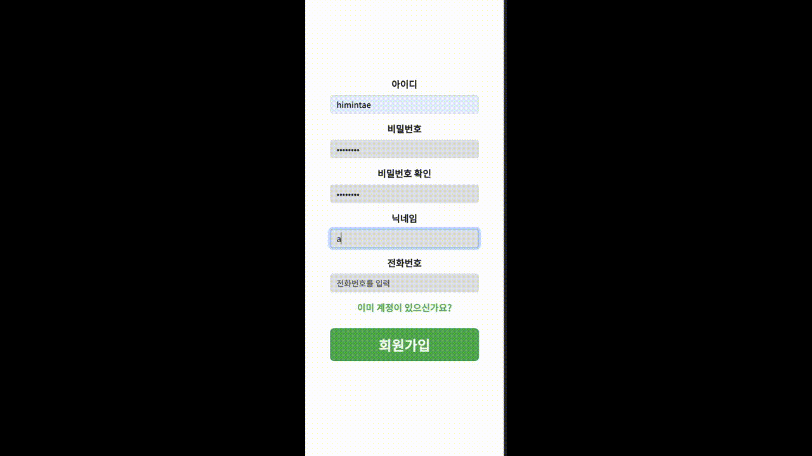

</hr>

<h4>전화번호 인증</h4>

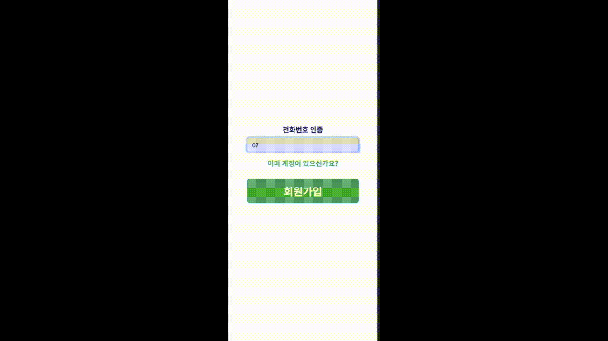

</hr>

<h4>메인 페이지</h4>

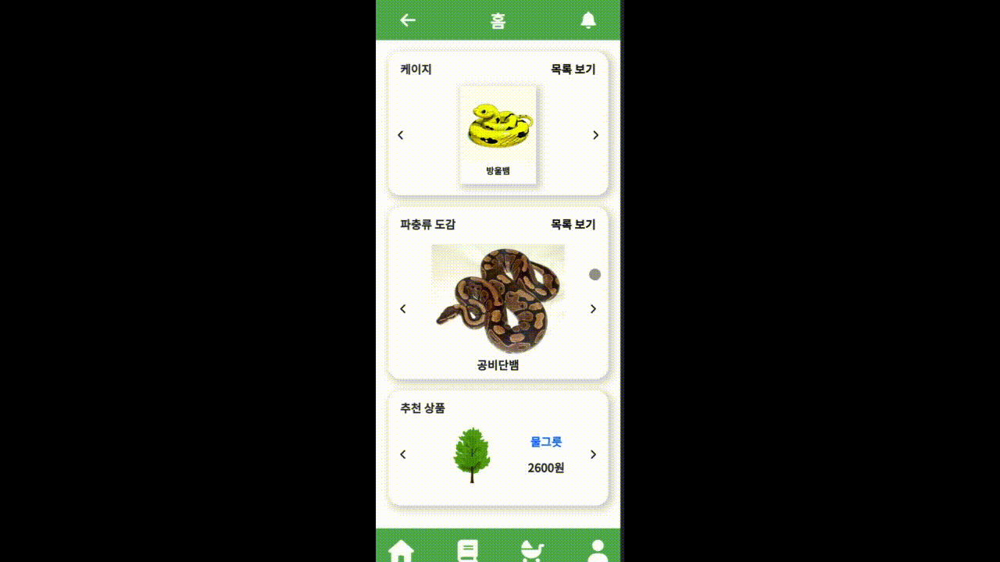

</hr>

<h4>케이지 만들기</h4>

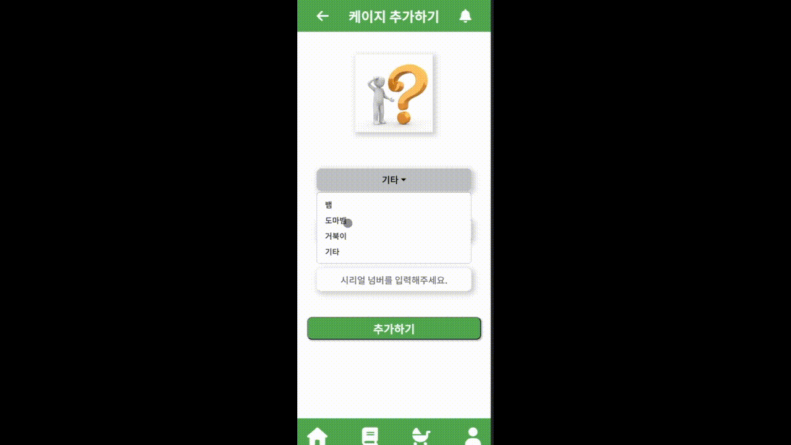

</hr>

<h4>동물 추가</h4>


</hr>

<h4>동물 상세</h4>


</hr>

<h4>실시간 영상</h4>

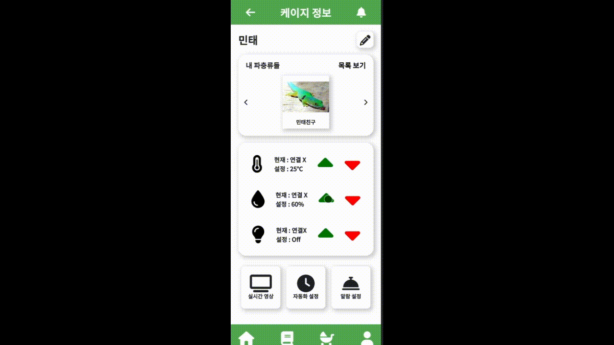

</hr>

<h4>자동화 설정</h4>

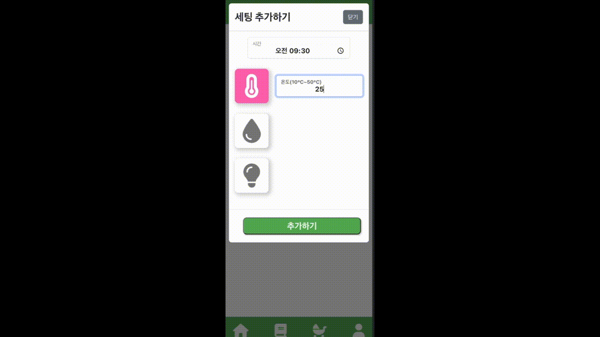

</hr>

<h4>알림 추가</h4>

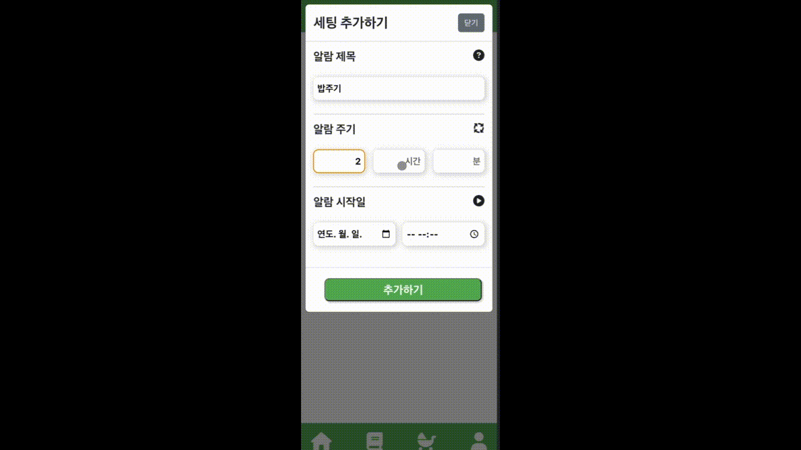

</hr>

<h4>도감</h4>

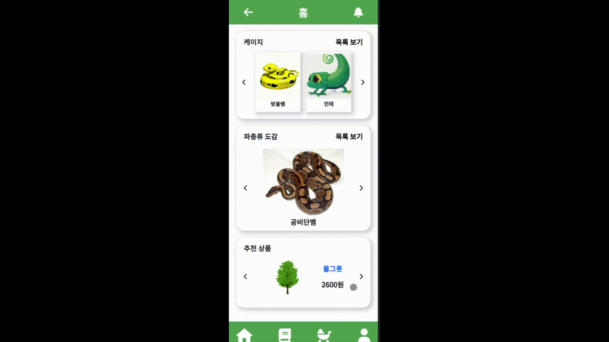

</hr>

<h4>로그아웃</h4>

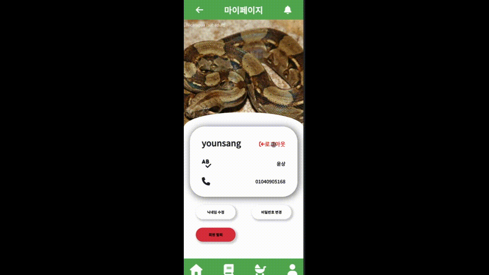

</hr>

## 4️⃣ 시스템 아키텍처 및 개발 환경

<h4>🌐 공통</h4>

| 상세               |       내용        |
| ------------------ | :---------------: |
| GitLab             |     형상 관리     |
| Jira               | 일정 및 이슈 관리 |
| Mattermost         |   커뮤니케이션    |
| Notion             | 일정 및 문서 관리 |
| IntelliJ           |   IDE (2022.02)   |
| Visual Studio Code |        IDE        |

</br>
<h4>📱 FrontEnd</h4>

| 상세             |  버전   |
| ---------------- | :-----: |
| React            |  5.0.1  |
| zustand          |  4.3.9  |
| react-router-dom | 6.14.2  |
| TypeScript       |  5.1.6  |
| Node.js          | 18.17.0 |
| NPM              |  9.6.7  |

</br>
<h4>💾 BackEnd</h4>

| 상세           |    버전     |
| :------------- | :---------: |
| JDK (Zulu)     |   11.0.19   |
| SpringBoot     |   2.7.13    |
| Mqttv3         |    1.2.5    |
| JWT            |    0.9.1    |
| MySQL          |   8.0.26    |
| Ubuntu         | 20.04.6 LTS |
| Nginx          |   1.18.0    |
| Docker         |   24.0.5    |
| Docker-compose |   2.20.2    |
| Jenkins        |   2.401.3   |

</br>

<h4>⛏ IoT</h4>

| 상세         |       버전        |
| :----------- | :---------------: |
| Arduino      | Arduino IDE 2.1.1 |
| Raspberry Pi | rasbian os 32bit  |
| paho.mqtt    |       1.6.1       |
| QT Framework |      5.15.2       |
| Flask        |       1.1.2       |

</br>

<h4>System Architecture</h4>

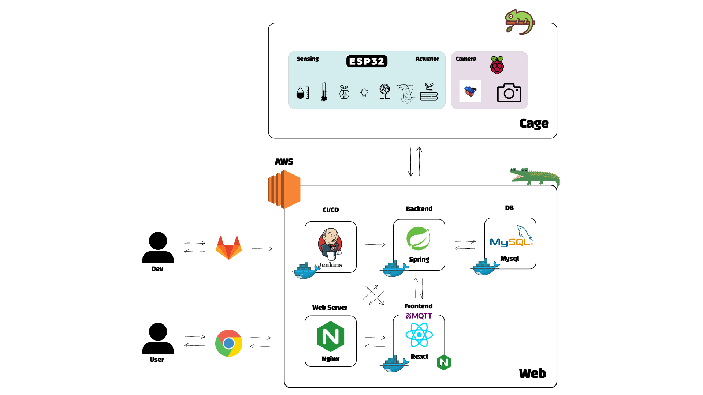

## 5️⃣ 컴포넌트 구조 및 프로토타입

<h4>📱 FrontEnd</h4>

```
📂 mqtt
  ㄴ📂 certs
  ㄴ📂 config
  ㄴ📂 data
  ㄴ📂 logs
📂 public
  ㄴ📂 images
  ㄴ📄 favicon.ico
  ㄴ📄 index.html
  ㄴ📄 manifest.json
📂 src
  ㄴ📂 assets
  ㄴ📂 components
  ㄴ📂 constants
  ㄴ📂 pages
    ㄴ📂 Auth
      ㄴ📄 Login.tsx
      ㄴ📄 SignUp.tsx
	ㄴ📂 Cage
    	ㄴ📄 AddCage.tsx
        ㄴ📄 Cages.tsx
	ㄴ📂 CageDetail
		ㄴ📂 Animal
			ㄴ📄 AddAnimal.tsx
			ㄴ📄 AnimalDetail.tsx
			ㄴ📄 AnimalList.tsx
        ㄴ📄 AlarmSetting.tsx
        ㄴ📄 AutoSetting.tsx
        ㄴ📄 CageDetail.tsx
        ㄴ📄 CageInfo.tsx
        ㄴ📄 LiveVideo.tsx
	ㄴ📂 Dictionary
		ㄴ📄 DicDetail.tsx
        ㄴ📄 DicList.tsx
        ㄴ📄 Dictionary.tsx
	ㄴ📄 Main.tsx
	ㄴ📄 MyPage.tsx
  ㄴ📂 store
	ㄴ📄 animalDicStore.tsx
    ㄴ📄 itemStore.tsx
    ㄴ📄 myAnimalStore.tsx
    ㄴ📄 myCageStore.tsx
    ㄴ📄 myPageStore.tsx
    ㄴ📄 mySettingStore.tsx
    ㄴ📄 userInfoStore.tsx
  ㄴ📂 styles
  ㄴ📄 App.css
  ㄴ📄 App.tsx
  ㄴ📄 index.css
  ㄴ📄 index.tsx
  ㄴ📄 logo.svg
  ㄴ📄 react-app-env.d.ts
  ㄴ📄 reportWebVitals.ts
📄 .gitignore
🐳 docker-compose.yml
🐳 Dockerfile
📄 nginx.conf
📄 package-lock.json
📄 package.json
```

<h4>💾 BackEnd</h4>

```
📂 src/main/java
  ㄴ📦 com.ssafy.a101
  	ㄴ📄 A101Application.java
  	ㄴ📦 api
  		ㄴ📦 controller
        	ㄴ📄 AlarmController.java
            ㄴ📄 AnimalController.java
            ㄴ📄 AutoSetController.java
            ㄴ📄 CageController.java
            ㄴ📄 DictionaryController.java
            ㄴ📄 StoreController.java
            ㄴ📄 UserController.java
		ㄴ📦 request
        	ㄴ📄 AddAlarmRequest.java
            ㄴ📄 AddAnimalRequest.java
            ㄴ📄 AddAutoSetRequest.java
            ㄴ📄 AddCageRequest.java
            ㄴ📄 AddUserRequest.java
            ㄴ📄 LoginUserRequest.java
            ㄴ📄 SmsRequest.java
            ㄴ📄 UpdateAlarmRequest.java
            ㄴ📄 UpdateAnimalRequest.java
            ㄴ📄 UpdateAutoSetRequest.java
            ㄴ📄 UpdateCageRequest.java
            ㄴ📄 UpdateUserRequest.java
		ㄴ📦 response
        	ㄴ📄 AlarmResponse.java
            ㄴ📄 AnimalResponse.java
            ㄴ📄 AutoSetResponse.java
            ㄴ📄 CageResponse.java
            ㄴ📄 DictionaryResponse.java
            ㄴ📄 SmsResponse.java
            ㄴ📄 StoreResponse.java
            ㄴ📄 UserResponse.java
      	ㄴ📦 service
        	ㄴ📄 AlarmService.java
            ㄴ📄 AnimalService.java
            ㄴ📄 AutoSetService.java
            ㄴ📄 CageService.java
            ㄴ📄 DictionaryService.java
            ㄴ📄 SmsService.java
            ㄴ📄 StoreService.java
            ㄴ📄 UserService.java
	ㄴ📦 config
    	ㄴ📄 EmailConfig.java
        ㄴ📄 JwtFilter.java
        ㄴ📄 MqttPubConfig.java
        ㄴ📄 MqttSubConfig.java
        ㄴ📄 SecurityConfig.java
	ㄴ📦 db
    	ㄴ📦 entity
        	ㄴ📄 Alarm.java
            ㄴ📄 Animal.java
            ㄴ📄 AutoSet.java
            ㄴ📄 Cage.java
            ㄴ📄 Dictionary.java
            ㄴ📄 Message.java
            ㄴ📄 Store.java
            ㄴ📄 User.java
        ㄴ📦 repository
        	ㄴ📄 AlarmRepository.java
            ㄴ📄 AnimalRepository.java
            ㄴ📄 AutoSetRepository.java
            ㄴ📄 CageRepository.java
            ㄴ📄 DictionaryRepository.java
            ㄴ📄 StoreRepository.java
            ㄴ📄 UserRepository.java
	ㄴ📦 util
    	ㄴ📄 TokenUtil.java
📂 src/main/resources
    ㄴ📂 static
    ㄴ📂 templates
    ㄴ📄 application.yml
📄 .gitignore
📄 .gitkeep
🐳 docker-compose.yml
🐳 Dockerfile
🐘 build.gradle
🐘 gradlew
🐘 gradlew.bat
🐘 settings.gradle
```

<h4>⛏ IoT</h4>

```
📂 ESP
	ㄴ📄 main.ino
	ㄴ📄 header.h
	ㄴ📄 actuator.h
	ㄴ📄 sensing.h
	ㄴ📄 mqtt.h
	ㄴ📄 uartSerial.h
📂 RPI4
	ㄴ📄 main.py
📂 Koisk
    ㄴ📄 main.py
    ㄴ📄 kiosk.py
    ㄴ📄 kiosk.ui
```

## 6️⃣ 데이터베이스 모델링 (ERD)

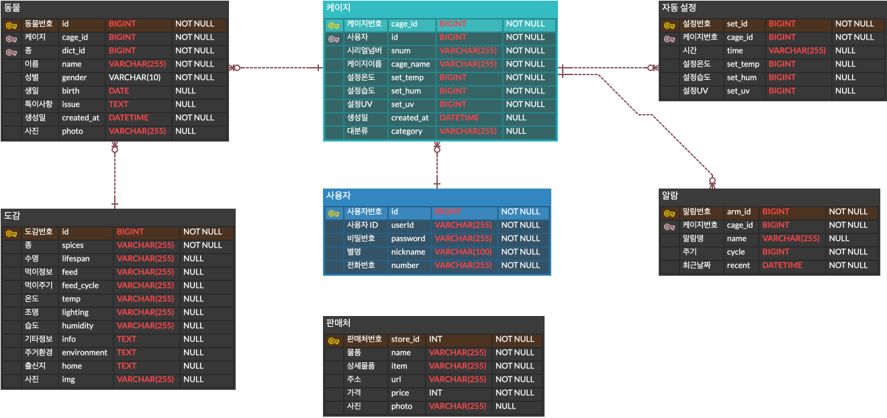

## 7️⃣ Convention

### Commit Convention

> **"[Type] #(Jira issue number) Commit message"**

- Type
  - **Fix** : 잘못된 동작을 고칠 때

    > fix function/error/typo in style.css

  - option
    - funtion : 고친 함수 명 (e.g. fix login function in index.html)
    - error : 수정한 에러 (e.g. fix [구체적 에러명] error in login.js)
    - typo : 오타 (e.g. fix typo in style.css)
  - **Add** : 새로운 것을 추가할 때

    > add mytest.test for test (새로운 파일 추가 시)

    > add blue color to style.css (기존 파일에 내용 추가 시)

  - **Move** : 코드나 파일을 이동할 때

    > move A to B (e.g. A를 B로 이동할 때)

  - **Rename** : 이름 변경이 있을 때

    > rename A to B (e.g. A를 B로 이름을 변경할 때)

  - **Update** : 정상적으로 동작하는 파일을 보완하는 경우

    > update test.js to use HTTPS (test.js에 기존의 프로토콜에서 HTTPS 프로토콜 사용으로 변경)

  - **Remove** : 삭제가 있을 때

    > remove test.js (파일 삭제 시)

    > remove black color from style.css (파일 내 부분 삭제 시)
- #(Jira issue number) : Click 시, Jira에서 해당 Issue에 대한 상세 내용 확인 가능
- Commit message : 변경 사항에 대해 명확하게 기술

## 8️⃣ Git Flow

```
master
└ develop
  ├ feature-front
  ├ feature-back
  ├ feature-iot
  └ feature-log
```

- master : 운영 서버로 배포하기 위한 브랜치
- develop : 다음 출시 기능을 개발하는 브랜치
- feature : 세부 기능을 개발하는 브랜치
  - front : 프론트엔드를 개발하는 브랜치
  - back : 백엔드를 개발하는 브랜치
  - iot : 임베디드를 개발하는 브랜치
  - log : 기록 및 기타


## **9️⃣ 회고**

| 이름                                                         | 내용                                                         |
| ------------------------------------------------------------ | ------------------------------------------------------------ |
| <a href="https://github.com/jeonghwanin"> | **인정환**<br />각자 맡은 부분들을 책임감있게 구현하고 항상 소통하고 서로 배려하는 분위기가 좋았습니다.<br />문제가 생겼을 때 팀원들과 공유하고 도와줘서 mqtt 및 https 통신 문제를 해결할 수 있어서 좋았습니다. |
| <a href="https://github.com/minsoon025"> | **김민태**<br />다 같이 모여서 프로젝트를 진행할 때는 좋은 의견을 항상 나누고 각자의 작업을 할 때는 열심히 수행해서 프로젝트가 착실히 이루어졌던 점이 좋았습니다. 특히 MQTT 통신을 할 때는 원활한 의사소통을 통해 각자 맡은 파트와 교류하는 법을 배웠습니다. 모두가 성장했다고 느낀 프로젝트였습니다. |
| <a href="https://github.com/Koneweekk"> | **김한주**<br />예상치 못한 문제가 발생해 계획보다 기간이 많이 지연됨에도 싫증내지 않고, 묵묵하게 문제를 해결한 기억이 상당히 좋게 남았습니다.<br />MQTT 보안 연결이나 실시간 동영상 송출 등 다양한 문제를 다 같이 해결한 것이 꽤나 값진 경험이었습니다. |
| <a href="https://github.com/seyi103"> | **손세이**<br />웹과 통신을 처음 시도해보는 과정에서 MQTT 통신 관련 어려움이 많았지만 각자 담당한 부분에서 소통하며 협력한 결과, 문제들을 해결할 수 있었던 좋은 경험이었습니다. |
| <a href="https://github.com/younprize"> | **조윤상**<br />우선 불협화음없이 좋은 팀워크로 성공적인 프로젝트를 할 수 있게 해준 조원들에게 너무나 감사하고, 지난 6주동안 스스로 많은 성장을 이룬 것 같아서 좋습니다. |
