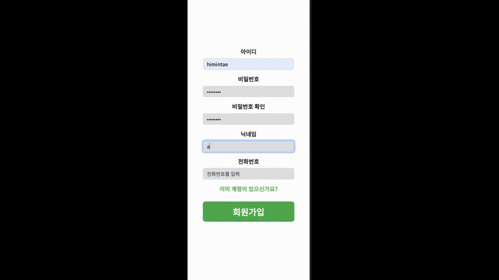
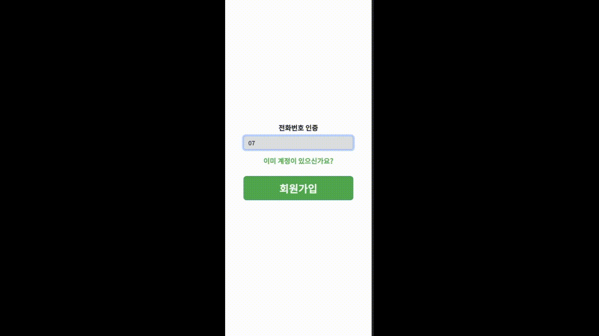
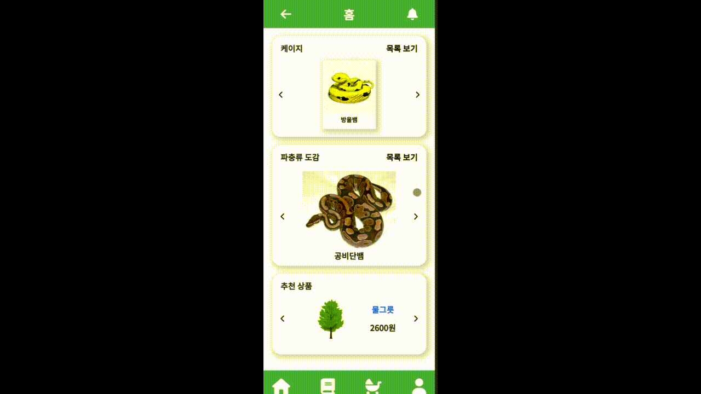
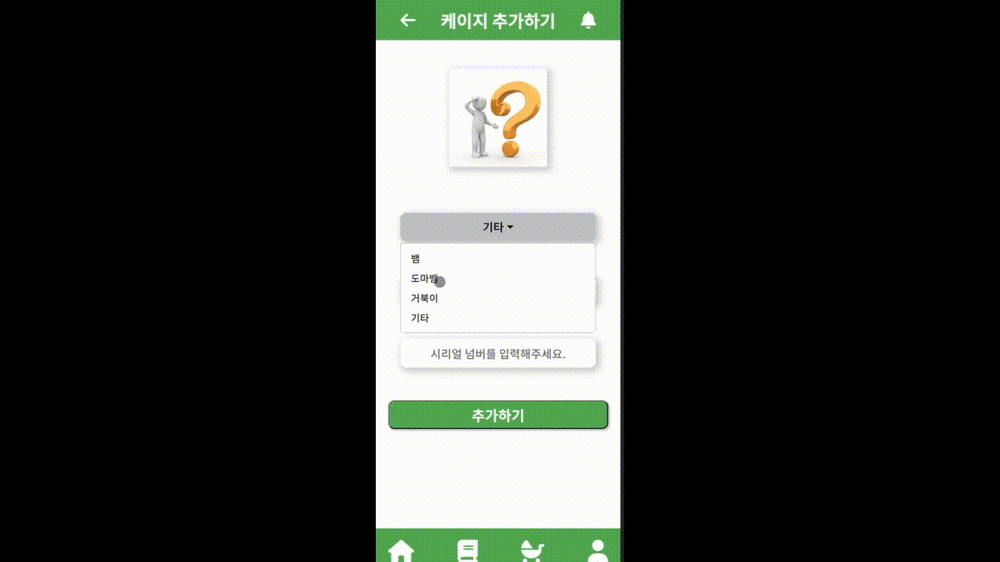
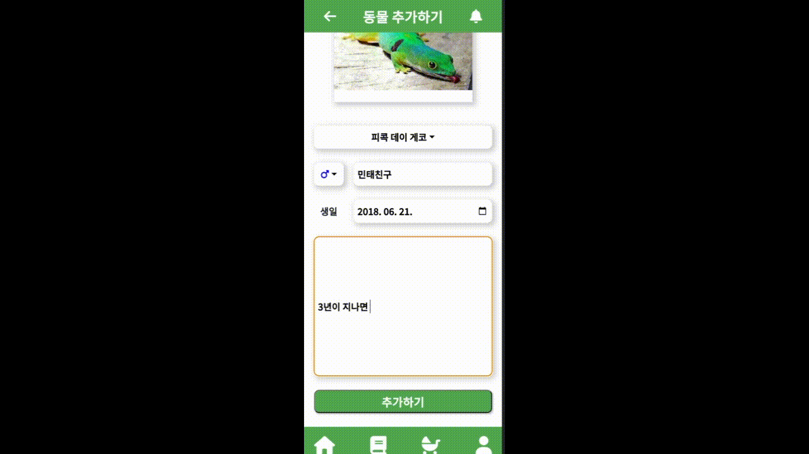
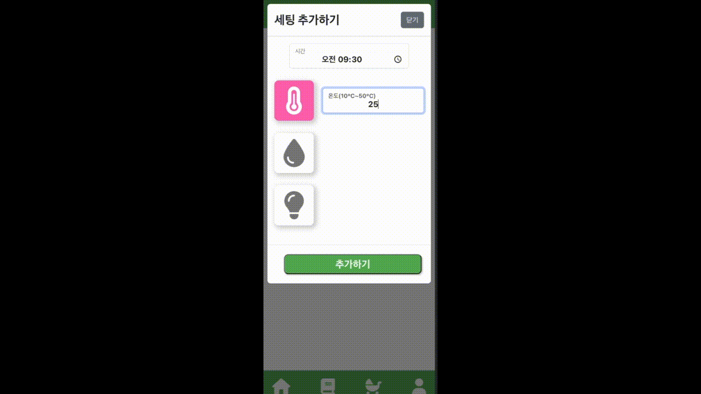
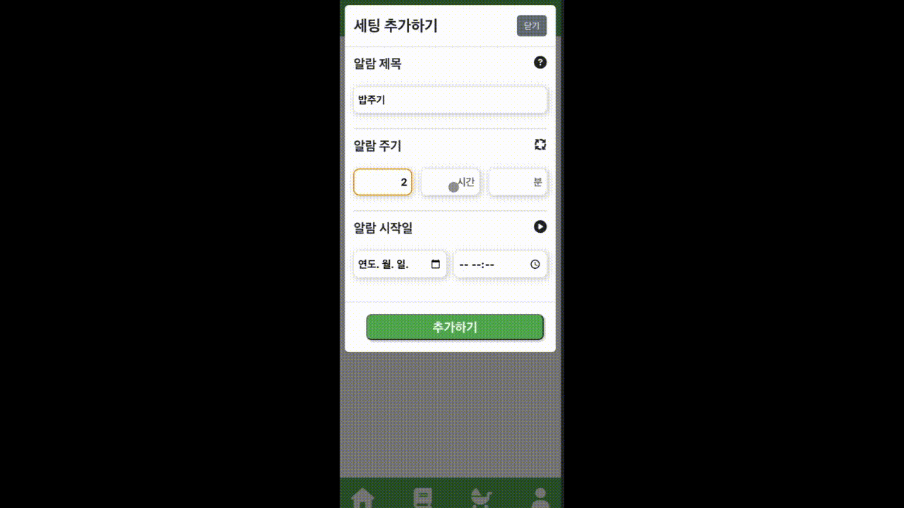
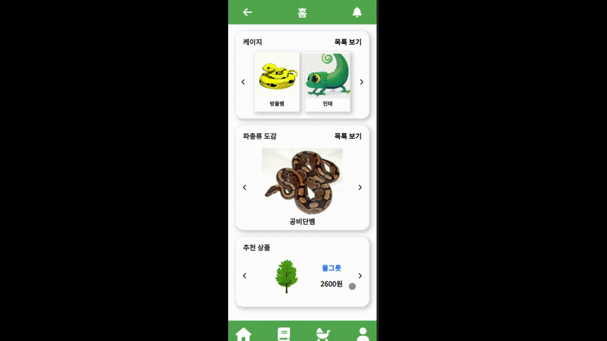
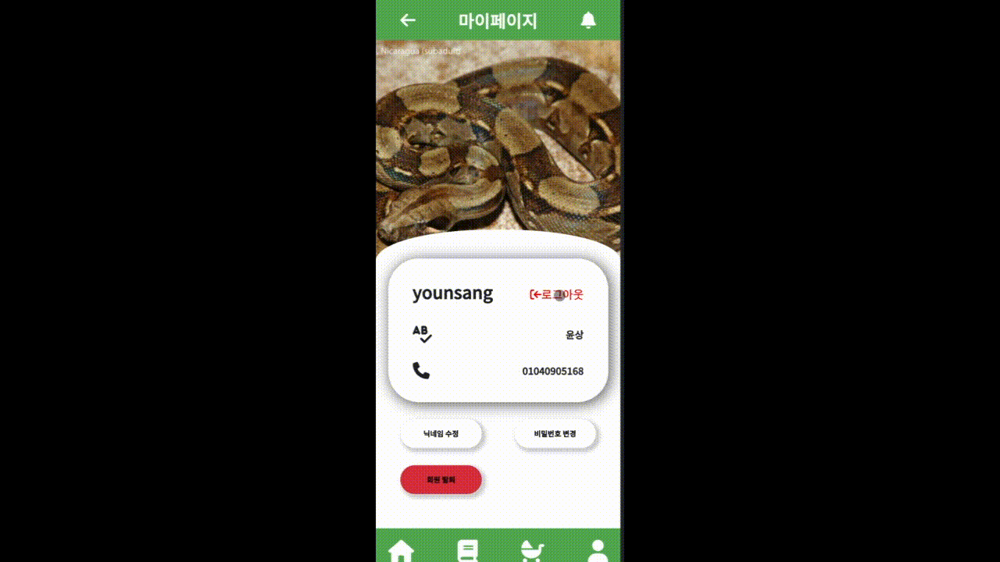

<h1>시연 시나리오</h1>

<h2>회원 가입</h2>

* 아이디, 비밀번호, 비밀번호 확인, 닉네임, 전화번호를 입력합니다.

<h2>전화번호 인증</h2>

* 문자로 전송된 인증 번호를 입력합니다.

<h2>메인 페이지</h2>

* 메인 페이지에 케이지, 파충류, 도감 추천 상품 기능이 있습니다.

<h2>케이지 만들기</h2>

* 분류된 파충류를 선택하고 케이지 이름 고유 시리얼 넘버를 입력합니다.

<h2>동물 추가</h2>

* 동물의 종류, 이름, 생일, 특이사항을 기입합니다.

<h2>동물 상세</h2>

* 동물 상세 페이지에서 동물, 성별, 생일 등을 확인합니다.

<h2>실시간 영상</h2>

* 실시간 영상 확인 및 파충류 팔로잉(추적) 기능, 카메라 조절이 가능합니다 

<h2>자동화 설정</h2>

* 자동으로 온도, 습도,  uv 가 설정될 시간을 설정합니다.

<h2>알림 추가</h2>

* 원하는 알림을 설정하고 문자 서비스를 통해 전달 받습니다.

<h2>도감</h2>

* 파충류 정보를 볼 수 있습니다.

<h2>마이 페이지</h2>

* 유저 정보에서 로그아웃 및 회원 탈퇴를 할 수 있습니다.

